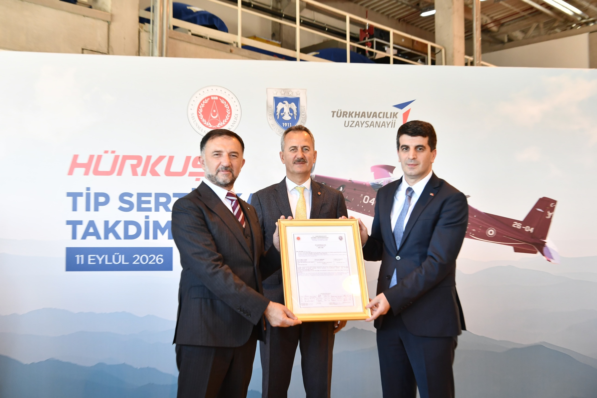

# HÜRKUŞ-II'ye Askerî Tip Sertifikası verildi: Türkiye'de bir ilk

**Özet:** Türkiye'de yerli olarak geliştirilen bir hava platformuna ilk kez Askerî Tip Sertifikası verildi. HÜRKUŞ-II için 12 sertifikasyon disiplininde yürütülen çalışmalarda 1.790 gereksinim doğrulandı, 950 kanıt dokümanı incelendi ve 153 sertifikasyon testi tamamlandı. Sertifika, 9 Eylül 2026'da Savunma Sanayii Başkanlığı (SSB) ve Hava Kuvvetleri Komutanlığı personelinden oluşan Sertifikasyon Kurulu tarafından verildi; takdim töreni 11 Eylül 2026'da düzenlendi.

*HÜRKUŞ-II Askerî Tip Sertifikası takdim töreni, 11 Eylül 2026. Ortada Savunma Sanayii Başkanı Prof. Dr. Haluk Görgün. (Fotoğraf: SSB)*

## Sertifikasyonda yeni bir yetkinlik seviyesi

Savunma Sanayii Başkanlığı'nın (SSB) 11 Eylül 2026 tarihli basın bültenine göre HÜRKUŞ-II, uluslararası standartlara uygun ve tamamen millî insan kaynağıyla yürütülen kapsamlı bir sertifikasyon sürecinin sonunda Askerî Tip Sertifikası aldı. Böylece Türkiye'de yerli olarak geliştirilen bir hava platformu için askerî tip sertifikasyon süreci **ilk kez** başarıyla tamamlanmış oldu.

Sertifika, 9 Eylül 2026'da SSB ve Hava Kuvvetleri Komutanlığı personelinden oluşan Sertifikasyon Kurulu tarafından verildi. Sertifikanın yayımlanması dolayısıyla 11 Eylül 2026'da düzenlenen törenle, Türkiye'nin hava platformlarını yalnızca tasarlama ve üretme değil; test etme, doğrulama, uçuşa elverişliliğini değerlendirme ve sertifikalandırma alanlarında ulaştığı millî yetkinlik de ortaya konuldu.

## Görgün: "Kendi teknik otoritemizi ve sertifikasyon kültürümüzü de inşa ediyoruz"

Savunma Sanayii Başkanı Prof. Dr. Haluk Görgün, HÜRKUŞ-II'nin Askerî Tip Sertifikası'nın Türk havacılık sanayisi açısından teknik olduğu kadar stratejik bir eşik niteliği taşıdığını vurguladı. Görgün'ün açıklaması şöyle:

> "9 Eylül 2026, Türk havacılık sanayimiz açısından teknik olduğu kadar stratejik bir eşiktir. HÜRKUŞ-II'nin Askerî Tip Sertifikası; Türkiye'nin kendi hava aracını tasarlama, üretme, test etme, doğrulama ve sertifikalandırma yetkinliğinin somut bir göstergesidir. Bu belge, çok yoğun bir mühendislik, test ve doğrulama emeğinin sonucudur. Biz yalnızca hava platformları geliştirmiyor; bu platformların güvenilirliğini kendi insanımızla doğrulayacak teknik otoriteyi, metodolojiyi ve sertifikasyon kültürünü de inşa ediyoruz. HÜRKUŞ-II'de kazandığımız sertifikasyon tecrübesi, gelecekteki millî hava platformlarımız için kalıcı bir yetkinliğe ve güçlü bir kurumsal hafızaya dönüşecektir. HÜRKUŞ-II'nin kanatlarında, kendi tasarımına, kendi testine ve kendi teknik yetkinliğine güvenen bir Türkiye'nin iradesi vardır. Bu kabiliyeti daha ileriye taşımaya kararlıyız. Sürece katkı sunan SSB Kalite-Test ve Sertifikasyon ekiplerimize, Hava Kuvvetleri Komutanlığımıza, Millî Savunma Bakanlığımıza, TR Uçuşa Elverişlilik ve TUSAŞ ekiplerine, görev alan bütün mühendis ve uzmanlarımıza teşekkür ediyorum."

## Millî uzmanlık birikimi ortak çalışmada buluştu

HÜRKUŞ-II'nin sertifikasyon faaliyetleri, farklı kurumlardan uzmanların müşterek teknik çalışmasıyla yürütüldü. Süreçte görev alan ekipler şöyle:

| Kurum / Kuruluş | Görev | Uzman sayısı |
|---|---|---|
| SSB Kalite-Test ve Sertifikasyon Daire Başkanlığı | Sertifikasyon otoritesi | 7 |
| TR Uçuşa Elverişlilik (TRUE) | SSB adına sertifikasyon panelleri | 16 |
| Hava Kuvvetleri Komutanlığı | Sertifikasyon Kurulu / paneller | 5 |
| Millî Savunma Bakanlığı | Hava Kuvvetleri Komutanlığı adına sertifikasyon panelleri | 12 |
| TUSAŞ (yüklenici) | Uçuşa Elverişlilik Uzmanı | 40 |
| TUSAŞ (yüklenici) | Tasarım ve Üretim Organizasyon Onayı uzmanı | 10 |

Böylece tasarımdan üretime, doğrulamadan teknik değerlendirmeye uzanan sertifikasyon sürecinde Türkiye'nin farklı kurum ve kuruluşlarında oluşan uzmanlık birikimi ortak bir yapı altında buluşturuldu.

## 12 sertifikasyon disiplininde bütüncül değerlendirme

HÜRKUŞ-II Projesi'nde sertifikasyon çalışmaları 12 ayrı disiplin altında, her biri ayrı sertifikasyon panelinde yürütüldü:

1. Aviyonik
2. Elektronik donanım
3. Elektrik sistemleri ve elektromanyetik ortam etkileri
4. İtki-yakıt
5. İnsan faktörleri
6. Kabin emniyeti
7. Sistem emniyeti
8. Sürekli uçuşa elverişlilik
9. Uçak sistemleri
10. Uçuş performansı
11. Yapısal
12. Yazılım

Bu çalışmalar kapsamında **283 panel toplantısı ve çalıştay** gerçekleştirildi. Yazılım ve elektronik donanım faaliyetlerine destek veren alt yüklenici firmalara yönelik **225 denetim** yapıldı. Süreçte ayrıca **1.790 sertifikasyon gereksinimi** doğrulandı, **950 sertifikasyon kanıt dokümanı** ilgili paneller bünyesinde teknik açıdan incelendi ve değerlendirildi.

## 153 sertifikasyon testi gerçekleştirildi

Sertifikasyon planlarında tanımlanan doğrulama faaliyetleri kapsamında HÜRKUŞ-II üzerinde farklı doğrulama seviyelerinde toplam 153 test tamamlandı:

| Test türü | Adet |
|---|---|
| Laboratuvar testi | 38 |
| Yer testi | 71 |
| Uçuş testi | 44 |
| **Toplam** | **153** |

Test ve doğrulama faaliyetleriyle hava aracının ilgili sertifikasyon gereksinimlerini karşılayıp karşılamadığı teknik kanıtlarla değerlendirildi ve Askerî Tip Sertifikası'na temel oluşturan kapsamlı kanıt altyapısı oluşturuldu.

## Gelecek platformlar için kalıcı kabiliyet

SSB, projeyle kazanılan kabiliyetin gelecek hava platformlarının tasarım, test, doğrulama ve sertifikasyon süreçlerinde Türkiye'nin millî yetkinliğini daha ileri seviyeye taşımasını hedefliyor. Görgün'ün ifadesiyle HÜRKUŞ-II'de edinilen sertifikasyon tecrübesi, "gelecekteki millî hava platformları için kalıcı bir yetkinliğe ve güçlü bir kurumsal hafızaya" dönüşecek.

## Sık sorulan sorular

**HÜRKUŞ-II Askerî Tip Sertifikası ne zaman verildi?**
Sertifika, 9 Eylül 2026'da SSB ve Hava Kuvvetleri Komutanlığı personelinden oluşan Sertifikasyon Kurulu tarafından verildi. Takdim töreni 11 Eylül 2026'da düzenlendi.

**Askerî Tip Sertifikası neden önemli?**
Türkiye'de yerli olarak geliştirilen bir hava platformu için uluslararası standartlara uygun ve tamamen millî insan kaynağıyla yürütülen askerî tip sertifikasyon süreci ilk kez tamamlandı. Bu, tasarım ve üretimin yanı sıra test, doğrulama ve sertifikalandırma yetkinliğinin de millî olarak kazanıldığını gösteriyor.

**Sertifikasyon sürecinde kaç test yapıldı?**
Toplam 153 sertifikasyon testi yapıldı: 38 laboratuvar testi, 71 yer testi ve 44 uçuş testi.

**Sertifikasyon sürecine hangi kurumlar katıldı?**
SSB Kalite-Test ve Sertifikasyon Daire Başkanlığı, TR Uçuşa Elverişlilik (TRUE), Hava Kuvvetleri Komutanlığı, Millî Savunma Bakanlığı ve yüklenici TUSAŞ.

---

*Kaynak: Savunma Sanayii Başkanlığı (SSB), "HÜRKUŞ-II'ye Askerî Tip Sertifikası" başlıklı basın bülteni, 11 Eylül 2026. Fotoğraf: HÜRKUŞ-II Tip Sertifikası Takdim Töreni, 11 Eylül 2026.*
